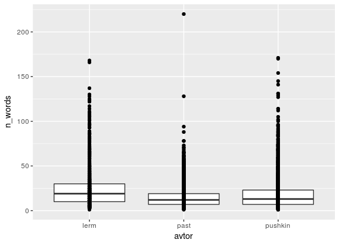
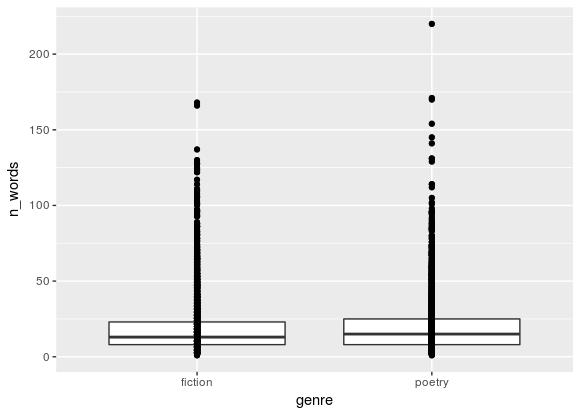

```{r setup, include=FALSE}
knitr::opts_chunk$set(echo = TRUE)
```

### Materials

[Link to the dataset](https://github.com/maryszmary/R_course/blob/master/project/total.csv).
[Data annotation script](https://github.com/maryszmary/R_course/blob/master/project/collect_data.r)

## Introduction

### Research idea

Genre/author analisys using computational methods is considered to be a part of Digital Humanities. In our research, we investigate how features assosiated with text complex vary by literature genres (fiction and poetry) and by authors.

### Features

* sentence length
* average word length

## Research hypothesis  

We suppose that:

* fiction texts show more complexity than poetry (null hypothesis: there's no significant difference)
* in terms of text complexity, there is more difference between text genres than between different authors (null hypothesis: vice versa or no significant difference)


## Data

The data for our research come from three Russian authors: Alexander Pushkin, Michael Lermontov and Borisr Pasternak. For each aughtor, we take prosaic and poetry text.

The data were downloaded from internet in plain text, and then syntactically parsed using the `udpipe` library (R binding for UDPipe).


## R libraries in use
```{r libraries}
library(tidyverse)
library(ggplot2)
```

## Analysis: descriptive statistics

We looked at the distribution of average sentence:






```{r tables}
df_general <-  read.csv('df_general.csv')
knitr::kable(df_general,format="html")
```


## Linguistic interpretation of the quantitative results  

It's not correct to make any conclusions now, but given the data on the average sentence langth (in tokens) we can say that:

* there is more difference between authors than between genres
* Pasternak's text have consistant length

## Future work

Further development of our research might include:

* extracting more features, especially assosiated with syntax
* using clustering for determining if complexity varies between genres greater than between authors or vice versa